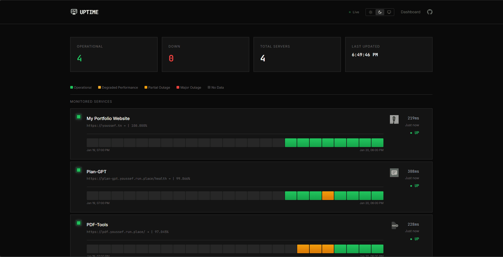

# Uptime Page

[](https://www.python.org/)
[](https://fastapi.tiangolo.com/)
[](LICENSE)

A lightweight, self-hosted uptime monitor with a public status page and an authenticated administration dashboard.



## Features

- Public status page with current service health and recent uptime history
- Authenticated dashboard for adding, editing, reordering, and removing monitors
- Scheduled HTTP checks with configurable intervals and timeouts
- Response-time tracking and hourly uptime visualization
- PostgreSQL persistence managed through Alembic migrations
- Per-route rate limiting, JWT authentication, and Argon2 password hashing
- Responsive interface with dark-mode support

## Quick start with Docker

You need [Git](https://git-scm.com/) and [Docker Compose](https://docs.docker.com/compose/).

```bash
git clone https://github.com/youssefsz/Uptime-page.git
cd Uptime-page
cp .env.example .env
```

Before starting the service, replace `SECRET_KEY` and `ADMIN_PASSWORD` in `.env`. Generate a suitable secret with:

```bash
python -c "import secrets; print(secrets.token_urlsafe(48))"
```

Start the application and its PostgreSQL database:

```bash
docker compose -f compose.dev.yml up --build
```

Open the public status page at <http://localhost:8000> or sign in at <http://localhost:8000/login>. The API documentation is available at <http://localhost:8000/docs>.

> On Windows PowerShell, use `Copy-Item .env.example .env` instead of `cp`. The initial admin account is created during the first database migration; changing the environment variables later does not change an existing account.

## Local development

### Prerequisites

- Python 3.11 or newer
- [uv](https://docs.astral.sh/uv/)
- PostgreSQL 14 or newer

Create a database, copy `.env.example` to `.env`, and update `DATABASE_URL`, `SECRET_KEY`, and the initial admin credentials. Then install the locked dependencies and start the development server:

```bash
uv sync --locked
uv run uvicorn app.main:app --reload
```

The application applies pending Alembic migrations at startup. To run them separately:

```bash
uv run alembic upgrade head
```

Run the same checks used by CI before opening a pull request:

```bash
uv run ruff check .
uv run pytest
```

## Configuration

Configuration is read from environment variables and, for local development, an optional `.env` file.

| Variable | Default | Purpose |
| --- | --- | --- |
| `DATABASE_URL` | Local PostgreSQL URL | SQLAlchemy async database connection |
| `SECRET_KEY` | Insecure placeholder | Signs JWT access tokens; always replace it |
| `ALGORITHM` | `HS256` | JWT signing algorithm |
| `ACCESS_TOKEN_EXPIRE_MINUTES` | `1440` | Access-token lifetime |
| `ADMIN_USERNAME` | `admin` | Username seeded by the initial migration |
| `ADMIN_PASSWORD` | Insecure placeholder | Password seeded by the initial migration |
| `PING_INTERVAL_SECONDS` | `30` | Delay between scheduled checks |
| `PING_TIMEOUT_SECONDS` | `10` | Timeout for each HTTP check |
| `HOST` | `0.0.0.0` | Application bind address |
| `PORT` | `8000` | Application port |
| `DEBUG` | `false` | SQLAlchemy debug logging |
| `CORS_ORIGINS` | `[]` | JSON array of trusted cross-origin frontend URLs |

Never commit `.env` or production credentials. See [SECURITY.md](SECURITY.md) for vulnerability reporting and deployment guidance.

## API

FastAPI serves interactive OpenAPI documentation at `/docs` and `/redoc`.

| Method | Endpoint | Authentication | Description |
| --- | --- | --- | --- |
| `POST` | `/api/auth/login` | Public | Exchange form credentials for a token |
| `POST` | `/api/auth/login/json` | Public | Exchange JSON credentials for a token |
| `GET` | `/api/auth/me` | Bearer token | Return the current user |
| `PUT` | `/api/auth/password` | Bearer token | Change the current user's password |
| `GET` | `/api/servers` | Public | List monitors and their current status |
| `GET` | `/api/servers/with-bars` | Public | List monitors with uptime-bar data |
| `GET` | `/api/servers/{id}/history` | Public | Return recent check history |
| `GET` | `/api/servers/{id}/stats` | Public | Return aggregate monitor statistics |
| `POST` | `/api/servers` | Bearer token | Create a monitor |
| `PUT` | `/api/servers/{id}` | Bearer token | Update a monitor |
| `DELETE` | `/api/servers/{id}` | Bearer token | Delete a monitor |
| `POST` | `/api/servers/{id}/ping` | Bearer token | Run an immediate check |

## Deployment

The included `Dockerfile` produces the application image. The existing `docker-compose.yml` and `deploy.sh` implement the maintainer's Traefik-based blue/green deployment and depend on pre-existing external networks. They are examples for that infrastructure, not a generic production configuration.

For your own deployment:

1. Put the application behind a TLS-terminating reverse proxy.
2. Use a dedicated PostgreSQL database and least-privilege database credentials.
3. Set a unique, high-entropy `SECRET_KEY` and strong admin password through a secret manager.
4. Restrict dashboard access at the network or proxy layer when possible.
5. Back up PostgreSQL and test restoration regularly.

The unauthenticated `GET /health` endpoint is suitable for container and load-balancer health checks.

## Contributing

Bug reports and pull requests are welcome. Read [CONTRIBUTING.md](CONTRIBUTING.md) for the development workflow and review checklist. By participating, you agree to follow the [Code of Conduct](CODE_OF_CONDUCT.md).

For usage questions, see [SUPPORT.md](SUPPORT.md). Please report security issues privately as described in [SECURITY.md](SECURITY.md).

## License

Uptime Page is available under the [MIT License](LICENSE).

Created by [Youssef Dhibi](https://youssef.tn).
